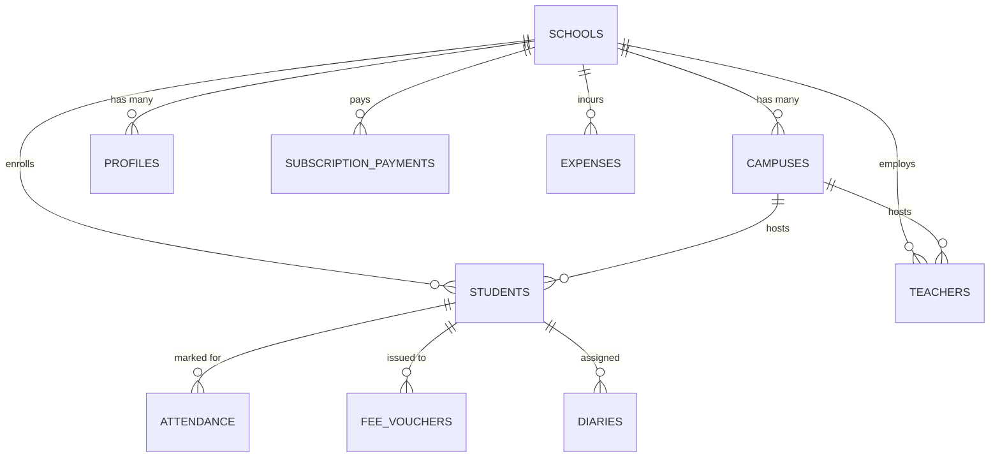

# Drizzle ORM Schema & Database Architecture

## Overview
EduFlow utilizes **Drizzle ORM** with PostgreSQL (hosted on Supabase) via `postgres.js`. The database schema is engineered for strict multi-tenant isolation, data integrity, and fast querying across school portals.

Primary Schema Definition: [`lib/db/schema.ts`](file:///home/basit/eduflow/lib/db/schema.ts)  
Drizzle Configuration: [`drizzle.config.ts`](file:///home/basit/eduflow/drizzle.config.ts)  
Client Export: [`lib/db/index.ts`](file:///home/basit/eduflow/lib/db/index.ts)  
Part of the [[INDEX|EduFlow OS Knowledge Graph]].

---

## 1. Relational Schema Models

### Table Definitions & Constraints

#### 1. `schools`
Central multi-tenant anchor table representing educational institutions.
- **Fields:** `id` (UUID PK), `name` (text), `slug` (text unique), `city` (text, default 'Karachi'), `admin_email` (text), `owner_name` (text), `phone` (varchar 30), `plan_tier` ('starter', 'pro', 'enterprise'), `plan_status` ('trial', 'active', 'past_due', 'canceled'), `created_at`, `trial_starts_at`, `trial_ends_at`, `first_paid_at`, `last_paid_at`, `next_billing_date`, `monthly_amount` (numeric 12,2), `school_setup_complete` (boolean).
- **Indexes:** `schools_slug_idx`, `schools_created_at_idx`.
- **Linked Features:** [[features/multi-tenancy]], [[features/super-admin]].

#### 2. `subscription_payments`
Platform SaaS billing transactions between schools and EduFlow.
- **Fields:** `id` (UUID PK), `school_id` (UUID FK -> `schools.id`, cascade delete, NOT NULL), `amount` (numeric 12,2), `currency` (PKR), `billing_cycle` ('monthly'/'annual'), `payment_method` ('bank_transfer', 'online'), `status` ('paid', 'pending', 'failed'), `paid_at`, `period_start`, `period_end`, `reference_no`, `notes`.
- **Indexes:** `sub_payments_school_id_idx`, `sub_payments_paid_at_idx`.
- **Linked Features:** [[features/super-admin]], [[features/finance-billing]].

#### 3. `campuses`
Physical branch locations operated by a school system.
- **Fields:** `id` (UUID PK), `school_id` (UUID FK -> `schools.id`, cascade delete, NOT NULL), `name` (text), `city` (text), `phone` (varchar 30), `address` (text).
- **Indexes:** `campuses_school_id_idx`.
- **Linked Features:** [[features/multi-tenancy]].

#### 4. `profiles`
User metadata synced to Supabase `auth.users`.
- **Fields:** `id` (UUID PK matching auth.users), `email` (text), `full_name` (text), `role` (text: `school_admin`, `teacher`, `parent`, `super_admin`), `school_id` (UUID FK -> `schools.id`, set null), `onboarding_completed` (boolean), `school_setup_complete` (boolean).
- **Indexes:** `profiles_email_idx`, `profiles_school_id_idx`.
- **Linked Features:** [[architecture/auth]].

#### 5. `students`
Student enrollment registry.
- **Fields:** `id` (UUID PK), `school_id` (UUID FK -> `schools.id`, cascade delete, NOT NULL), `campus_id` (UUID FK -> `campuses.id`, set null), `parent_id` (UUID), `full_name` (text), `roll_number` (varchar 50), `grade` (varchar 20), `section` (varchar 10), `gender`, `guardian_name`, `guardian_phone`, `guardian_email`, `monthly_fee` (numeric 10,2), `status` ('active', 'inactive', 'alumni').
- **Constraints & Indexes:** 
  - Composite Unique: `students_school_roll_uq` ON (`school_id`, `roll_number`). Ensures roll numbers are unique within each school but can overlap across different schools.
  - Indexes on `school_id` and `parent_id`.
- **Linked Features:** [[features/students]], [[features/finance-billing]].

#### 6. `teachers`
Faculty and staff registry.
- **Fields:** `id` (UUID PK), `school_id` (UUID FK -> `schools.id`, cascade delete, NOT NULL), `campus_id` (UUID FK -> `campuses.id`, set null), `full_name` (text), `employee_code` (varchar 50), `email`, `phone`, `department`, `specialization`, `monthly_salary` (numeric 10,2), `status` ('active', 'resigned').
- **Constraints & Indexes:**
  - Composite Unique: `teachers_school_emp_uq` ON (`school_id`, `employee_code`).
  - Index on `school_id`.
- **Linked Features:** [[features/teachers]].

#### 7. `attendance`
Daily attendance logging for students.
- **Fields:** `id` (UUID PK), `school_id` (UUID FK -> `schools.id`, cascade delete, NOT NULL), `student_id` (UUID FK -> `students.id`, cascade delete, NOT NULL), `date` (varchar 10: YYYY-MM-DD), `status` ('present', 'absent', 'leave', 'late'), `remarks`, `marked_at`.
- **Constraints & Indexes:**
  - Composite Unique: `attendance_student_date_uq` ON (`student_id`, `date`). Prevents duplicate attendance marks for a student on any single day.
  - Index on (`school_id`, `date`).
- **Linked Features:** [[features/attendance]].

#### 8. `fee_vouchers`
Monthly fee challans and payment tracking (Pakistani banking format).
- **Fields:** `id` (UUID PK), `school_id` (UUID FK -> `schools.id`, cascade delete, NOT NULL), `student_id` (UUID FK -> `students.id`, cascade delete, NOT NULL), `challan_number` (varchar 50), `month_year` (varchar 20), `amount` (numeric 10,2), `due_date` (varchar 10), `status` ('unpaid', 'paid', 'overdue'), `paid_at`.
- **Constraints & Indexes:**
  - Composite Unique: `fee_vouchers_school_challan_uq` ON (`school_id`, `challan_number`).
  - Index on (`school_id`, `status`).
- **Linked Features:** [[features/finance-billing]].

#### 9. `expenses`
School operational expense registry.
- **Fields:** `id` (UUID PK), `school_id` (UUID FK -> `schools.id`, cascade delete), `description` (text), `vendor` (text), `category` (varchar 100, default 'General'), `amount` (numeric 12,2), `date` (varchar 10: YYYY-MM-DD).
- **Indexes:** `expenses_school_id_idx`, `expenses_date_idx`.
- **Linked Features:** [[features/finance-billing]].

#### 10. `diaries`
Daily student homework, notes, and teacher feedback.
- **Fields:** `id` (UUID PK), `school_id` (UUID FK -> `schools.id`, cascade delete), `student_id` (UUID FK -> `students.id`, cascade delete), `note` (text), `audio_url` (text).
- **Indexes:** `diaries_school_id_idx`, `diaries_student_id_idx`.
- **Linked Features:** [[features/academic-diary]].

---

## 2. PostgreSQL Row-Level Security (RLS)

EduFlow utilizes a hardened RLS policy set located in [`supabase/migrations/20260921_comprehensive_rls.sql`](file:///home/basit/eduflow/supabase/migrations/20260921_comprehensive_rls.sql):
- **`SECURITY DEFINER` Helper Functions:**
  - `get_auth_school_id()`: Reads the authenticated user's assigned `school_id` from `profiles` with fixed search path to avoid privilege escalation.
  - `get_auth_user_role()`: Returns current role (`school_admin`, `teacher`, `parent`, `super_admin`).
  - `is_super_admin()`: Verifies if the authenticated email is within the platform super admin list.
- **Policy Enforcement:**
  - Standard tenant isolation: `USING (school_id = get_auth_school_id() OR is_super_admin())`.
  - Zero cross-tenant data leakage on all tables (`students`, `teachers`, `attendance`, `fee_vouchers`, `expenses`, `diaries`).

---

## 3. Migration Log

1. [`drizzle/0000_nosy_lady_ursula.sql`](file:///home/basit/eduflow/drizzle/0000_nosy_lady_ursula.sql): Initial baseline schema.
2. [`drizzle/0001_cheerful_gorilla_man.sql`](file:///home/basit/eduflow/drizzle/0001_cheerful_gorilla_man.sql): Enforced `NOT NULL` on `school_id`, composite unique keys (`students_school_roll_uq`, `teachers_school_emp_uq`, `attendance_student_date_uq`, `fee_vouchers_school_challan_uq`), and `ON DELETE CASCADE`.
3. [`drizzle/0002_add_expenses_and_diaries.sql`](file:///home/basit/eduflow/drizzle/0002_add_expenses_and_diaries.sql): Added `expenses` and `diaries` tables for accounting and digital teacher diaries.

---

## Related Notes
- [[INDEX|Master Hub]]
- [[architecture/routing|Routing Architecture]]
- [[architecture/auth|Authentication & RBAC]]
- [[features/multi-tenancy|Multi-Tenancy Isolation]]
- [[features/finance-billing|Finance & Fee Billing]]
- [[features/students|Student Management]]
- [[TRACKER|Project Progress Tracker]]
