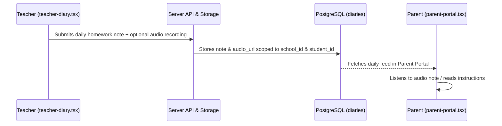

# Academic Diary, Homework & Audio Notes Architecture

## Overview
In the Pakistani educational ecosystem, the daily school diary (*Diary*) is the indispensable communication link between teachers and parents. EduFlow digitizes this experience, providing text notes, subject-specific homework tracking, and **audio voice notes** for parents who prefer spoken updates in Urdu or regional languages.

Primary Implementation Files:
- Teacher Diary Component: [`components/teacher-diary.tsx`](file:///home/basit/eduflow/components/teacher-diary.tsx)
- Teacher Route: [`app/(teacher)/teacher/diary/page.tsx`](file:///home/basit/eduflow/app/(teacher)/teacher/diary/page.tsx)
- Parent Diary Review: [`components/parent-portal.tsx`](file:///home/basit/eduflow/components/parent-portal.tsx)
- Database Model: `diaries` table in [`lib/db/schema.ts`](file:///home/basit/eduflow/lib/db/schema.ts)

Part of the [[INDEX|EduFlow OS Knowledge Graph]].

---

## 1. Feature Workflow

---

## 2. Key Capabilities

### A. Digital Homework & Activity Feed
- Teachers post assignments broken down by subject (English, Urdu, Mathematics, Islamiyat, General Science).
- Avoids paper diary loss and ensures parents receive prompt notifications of test dates and project submissions.

### B. Voice Notes for Accessible Parent Communication (`audio_url`)
- Many parents have varying levels of textual literacy in English.
- Teachers can record a quick 30-to-60 second audio clip directly from their smartphone/laptop browser.
- Audio files are stored securely and playable right inside the Parent Portal.

---

## Related Notes
- [[INDEX|Master Hub]]
- [[architecture/database|Database Architecture]]
- [[features/teachers|Teacher Workflows]]
- [[features/students|Student Registry]]
- [[TRACKER|Project Progress Tracker]]
