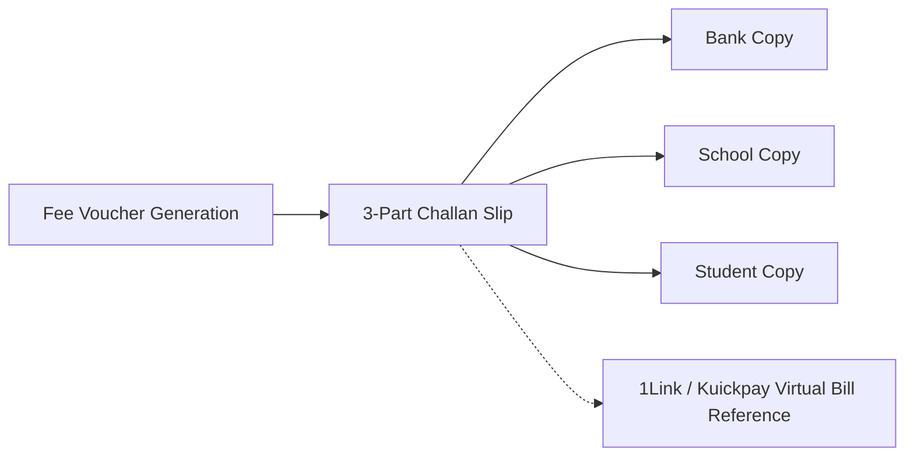

# Finance, Fee Vouchers & Billing Gateway Architecture

## Overview
The Finance & Fee Billing module is tailored specifically for the Pakistani education market. It addresses cash, banking, and digital collections with a unified workflow encompassing **3-Part Bank Challans**, **1Link / Kuickpay** payment reference generation, **Arrears Management**, and **School SaaS Subscription Billing**.

Primary Implementation Files:
- Finance Workspace: [`components/finance-workspace.tsx`](file:///home/basit/eduflow/components/finance-workspace.tsx)
- 3-Part Challan Component: [`components/challan-slip.tsx`](file:///home/basit/eduflow/components/challan-slip.tsx)
- Payment Gateway Modal: [`components/payment-gateway-modal.tsx`](file:///home/basit/eduflow/components/payment-gateway-modal.tsx)
- Arrears Ledger: [`components/arrears-ledger.tsx`](file:///home/basit/eduflow/components/arrears-ledger.tsx)
- Bank Settings Configuration: [`components/bank-settings-modal.tsx`](file:///home/basit/eduflow/components/bank-settings-modal.tsx)
- Subscription Logic: [`lib/subscription.ts`](file:///home/basit/eduflow/lib/subscription.ts)
- Database Tables: `fee_vouchers`, `expenses`, `subscription_payments` in [`lib/db/schema.ts`](file:///home/basit/eduflow/lib/db/schema.ts)

Part of the [[INDEX|EduFlow OS Knowledge Graph]].

---

## 1. The 3-Part Bank Challan Slip System

In Pakistan, tuition collection predominantly occurs through commercial bank branches (Meezan Bank, HBL, Bank Alfalah, etc.) or 1Link / Kuickpay consumer IDs.

### Structure of [`components/challan-slip.tsx`](file:///home/basit/eduflow/components/challan-slip.tsx)
- **Triple Split Design:** When printed or generated via PDF, the slip produces three identical, side-by-side vouchers separated by tear-lines:
  1. **Bank Copy** (Retained by the bank teller)
  2. **School Copy** (Submitted by parent to the school accounts office)
  3. **Student / Parent Copy** (Retained by guardian as legal receipt)
- **Challan Metadata:**
  - Challan Number (Scoped uniquely per school: `(school_id, challan_number)`).
  - Student Roll Number, Class, Section, Guardian Name.
  - Fee Heads Breakdown: Tuition Fee, Examination Fee, Computer/Lab Charges, Library Fund, Late Payment Surcharge.
  - Due Date & Validity Date.
  - School Bank Account & IBAN details.

---

## 2. Digital Payments & Gateway Integration

Handled by [`components/payment-gateway-modal.tsx`](file:///home/basit/eduflow/components/payment-gateway-modal.tsx):
- **Supported Channels:**
  - **JazzCash & EasyPaisa:** Mobile wallet payments for instant parent settlements.
  - **1Link / Kuickpay:** Generates a 1-bill consumer number allowing parents to pay through any Pakistani banking app or ATM.
  - **Direct Bank Transfer (IBFT):** Parents upload transfer screenshots or transaction reference IDs for manual reconciliation.
  - **Credit / Debit Cards:** Card processing via Stripe or local payment aggregators.

---

## 3. Arrears & Ledger Tracking

Implemented in [`components/arrears-ledger.tsx`](file:///home/basit/eduflow/components/arrears-ledger.tsx):
- Automatically carries over unpaid amounts from previous months.
- Computes overdue surcharges based on due date expiration.
- Real-time school accounts summary: Total Invoiced, Collected Revenue, Pending Receivables, Default Rate.

---

## 4. Operational Expense Logging

Backed by the `expenses` table in [`lib/db/schema.ts`](file:///home/basit/eduflow/lib/db/schema.ts):
- Allows school accountants to track vendor payments, utility bills, campus maintenance, and teacher payroll.
- Computes Net Operating Profit (Fee Collections minus Operational Expenses).

---

## 5. School SaaS Subscription Billing

Managed via [`lib/subscription.ts`](file:///home/basit/eduflow/lib/subscription.ts) and `/admin/billing`:
- Schools operate on a 30-day free trial upon signup (`trial_starts_at`, `trial_ends_at`).
- Tiered Pricing:
  - **Starter Tier:** PKR 2,500/month (Up to 150 students).
  - **Pro Tier:** PKR 5,000/month (Up to 500 students, full portals, SMS/WhatsApp ready).
  - **Enterprise Tier:** PKR 12,000/month (Unlimited students, multi-branch support).
- Billing lifecycle tracking: `trial` -> `active` -> `past_due` -> `canceled`.
- Audit log of platform fee payments in `subscription_payments`.

---

## Related Notes
- [[INDEX|Master Hub]]
- [[architecture/database|Database Architecture]]
- [[architecture/routing|Routing Architecture]]
- [[features/multi-tenancy|Multi-Tenancy Isolation]]
- [[features/students|Student Enrollment & Monthly Fee]]
- [[features/super-admin|Platform Subscription Management]]
- [[TRACKER|Project Progress Tracker]]
