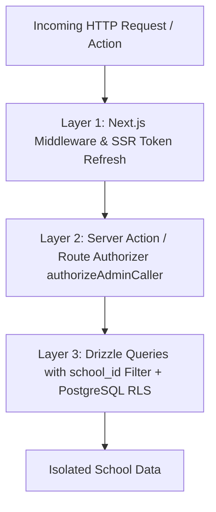

# Multi-Tenancy & School Isolation Architecture

## Overview
EduFlow is built as a multi-tenant Software-as-a-Service (SaaS) platform tailored for Pakistani school networks and individual private campuses. A single deployment securely services hundreds of distinct schools with complete cryptographic and logical separation of student records, financial ledger data, faculty information, and academic communications.

Part of the [[INDEX|EduFlow OS Knowledge Graph]].

---

## 1. Multi-Tenant Model

### The Tenant Anchor: `schools` Table
Every educational organization has a single primary entry in the `schools` table with a unique system UUID (`school_id`) and a URL-friendly slug (`slug`).
- Model: [`architecture/database#1-schools|Database: schools Table]]`
- Key Attributes: `id`, `name`, `slug`, `city`, `admin_email`, `plan_tier`, `plan_status`, `monthly_amount`.

### Mandatory Foreign Key Binding
All child data tables require a non-nullable reference to `schools.id` with cascading deletion:
- `students.school_id` (NOT NULL, CASCADE)
- `teachers.school_id` (NOT NULL, CASCADE)
- `attendance.school_id` (NOT NULL, CASCADE)
- `fee_vouchers.school_id` (NOT NULL, CASCADE)
- `expenses.school_id` (NOT NULL, CASCADE)
- `diaries.school_id` (NOT NULL, CASCADE)
- `subscription_payments.school_id` (NOT NULL, CASCADE)
- `campuses.school_id` (NOT NULL, CASCADE)

---

## 2. Multi-Layer Isolation Defense

EduFlow uses a 3-layer defense-in-depth model to prevent cross-tenant data leakage:

### Layer 1: Middleware & Route Gates
[`middleware.ts`](file:///home/basit/eduflow/middleware.ts) and [`components/role-gate.tsx`](file:///home/basit/eduflow/components/role-gate.tsx) verify session validity and ensure users cannot access portals belonging to other personas.

### Layer 2: Authoritative Backend Scoping (`authorizeAdminCaller`)
Located in [`lib/auth/authorizeAdmin.ts`](file:///home/basit/eduflow/lib/auth/authorizeAdmin.ts):
- Never relies on client-submitted `school_id` parameters in request bodies or query params.
- Resolves the caller's true `school_id` from trusted database profiles and signed JWT tokens.
- Injects the authenticated `school_id` directly into downstream Drizzle ORM queries.

### Layer 3: Database Composite Constraints & RLS
- **Composite Unique Keys:** Ensure that roll numbers (`students_school_roll_uq`), employee codes (`teachers_school_emp_uq`), and challan numbers (`fee_vouchers_school_challan_uq`) are unique *within* a school, allowing different schools to independently issue Roll #101 or Challan #1001 without collision.
- **PostgreSQL Row-Level Security:** [`supabase/migrations/20260921_comprehensive_rls.sql`](file:///home/basit/eduflow/supabase/migrations/20260921_comprehensive_rls.sql) enforces row-level policies preventing cross-tenant reads even if an ORM query omitted a WHERE filter.

---

## 3. School Tenant Onboarding Flow

1. **User Sign Up:** School owner registers at [`/signup`](file:///home/basit/eduflow/app/signup/page.tsx).
2. **Setup Wizard:** Redirected to [`/onboarding`](file:///home/basit/eduflow/app/onboarding/page.tsx) where they specify school name, city, phone, and campuses.
3. **Provisioning API:** `POST` to [`app/api/auth/setup-school/route.ts`](file:///home/basit/eduflow/app/api/auth/setup-school/route.ts) inserts the `schools` record, binds the caller profile's `school_id`, and grants 30-day free trial access.
4. **Portal Activation:** Redirects to [`/admin/overview`](file:///home/basit/eduflow/app/(school-admin)/admin/overview/page.tsx).

---

## Related Notes
- [[INDEX|Master Hub]]
- [[architecture/routing|Routing Architecture]]
- [[architecture/database|Database Architecture]]
- [[architecture/auth|Authentication & RBAC]]
- [[features/super-admin|Super Admin & Platform Management]]
- [[features/finance-billing|Finance & Fee Billing]]
- [[TRACKER|Project Progress Tracker]]
