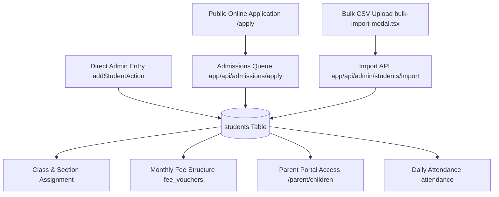

# Student & Admissions Management Architecture

## Overview
The Student Management module manages the end-to-end lifecycle of a student: from public online application (`/apply`), administrative review, class and section enrollment, roll number generation, monthly fee assignment, through to parent portal visibility.

Primary Implementation Files:
- Server Actions: [`app/actions/students.ts`](file:///home/basit/eduflow/app/actions/students.ts)
- Bulk CSV Import: [`components/bulk-import-modal.tsx`](file:///home/basit/eduflow/components/bulk-import-modal.tsx) & [`app/api/admin/students/import/route.ts`](file:///home/basit/eduflow/app/api/admin/students/import/route.ts)
- Public Admissions Portal: [`app/apply/page.tsx`](file:///home/basit/eduflow/app/apply/page.tsx) & [`app/api/admissions/apply/route.ts`](file:///home/basit/eduflow/app/api/admissions/apply/route.ts)
- School Admin Directory: [`app/(school-admin)/admin/students/page.tsx`](file:///home/basit/eduflow/app/(school-admin)/admin/students/page.tsx)
- Parent View: [`components/parent-portal.tsx`](file:///home/basit/eduflow/components/parent-portal.tsx)
- Database Model: `students` table in [`lib/db/schema.ts`](file:///home/basit/eduflow/lib/db/schema.ts)

Part of the [[INDEX|EduFlow OS Knowledge Graph]].

---

## 1. Lifecycle & Flow



---

## 2. Core Capabilities

### A. Online Admissions (`/apply`)
- Allows prospective parents to submit child details (Name, Grade applying for, Previous School, B-Form / CNIC, Father/Mother details, WhatsApp phone).
- Applications appear in the `/admin/admissions` dashboard for one-click approval or rejection.

### B. Bulk CSV Import (`bulk-import-modal.tsx`)
- High-performance in-browser CSV parsing using `PapaParse`.
- Validates required fields: Full Name, Roll Number, Grade, Section, Monthly Fee, Guardian Phone.
- Automatic column alias mapping (e.g. recognizing "Student Name", "Name", or "full_name").
- Upsert batch handling scoped securely to the caller's verified `school_id`.

### C. Unique Roll Numbering per School
- Enforced by PostgreSQL composite unique constraint:
  ```sql
  CONSTRAINT students_school_roll_uq UNIQUE (school_id, roll_number)
  ```
- Prevents accidental duplicates within a campus while allowing multiple schools on EduFlow to use identical numbering systems (e.g. "2026-A-01").

### D. Parent Portal Integration
- Students are linked to parent accounts via `guardian_phone` or `parent_id`.
- Parents logging in at `/parent` see their children's cards, attendance rates, unpaid challans, and daily teacher diaries.

---

## Related Notes
- [[INDEX|Master Hub]]
- [[architecture/database|Database Architecture]]
- [[architecture/routing|Routing Architecture]]
- [[features/multi-tenancy|Multi-Tenancy Isolation]]
- [[features/finance-billing|Fee Vouchers & Challans]]
- [[features/attendance|Daily Attendance Records]]
- [[features/academic-diary|Teacher Diary & Homework]]
- [[TRACKER|Project Progress Tracker]]
